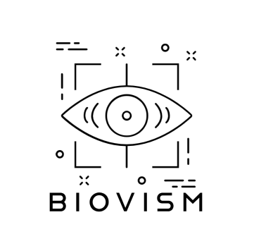

---
# A Demo section created with the Blank widget.
# Any elements can be added in the body: https://wowchemy.com/docs/writing-markdown-latex/
# Add more sections by duplicating this file and customizing to your requirements.

#widget: hero  # See https://wowchemy.com/docs/page-builder/
headless: true  # This file represents a page section.
weight: 10  # Order that this section will appear.
title: UGent Biovism Lab
#hero_media: icon.png

design:
  # Choose how many columns the section has. Valid values: 1 or 2.
  columns: '1'
  # Add custom styles
  css_style:
  css_class:
---

<!-- STYLE CSS -->

  
  

	
The <b>Biovism</b> lab focuses on the automated extraction of information from visual and multi-modal sensors and its embedding in computational models, with applications in the life sciences. Biovism is part of the research unit on <a href="https://kermit.ugent.be/"> Knowledge-based Systems</a> of the <a href="https://www.ugent.be/bw/en"> Faculty of Bioscience Engineering</a> at <a href="https://www.ugent.be/en"> Ghent University</a>.

  	 
	
Researchers at the lab develop new methodologies in the fields of computer vision, multi-modal data analysis and applied mathematics that allow to extract and fuse information from heterogeneous and unstructured data sources. Their main motivation is to improve the performance of computational models in the animal, pharmaceutical and environmental sciences.

  

